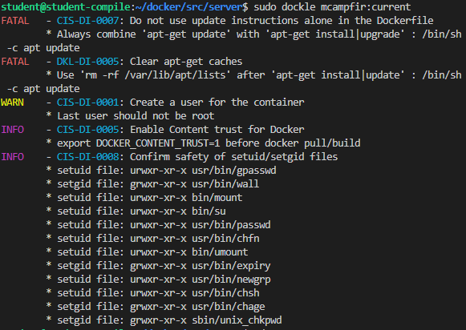

# Simple Docker

Введение в докер. Разработка простого докер образа для собственного сервера.  
## Contents

1.  Part 1. [Готовый докер](#part-1-готовый-докер) \
    Part 2. [Операции с контейнером](#part-2-операции-с-контейнером) \
    Part 3. [Мини веб-сервер](#part-3-мини-веб-сервер) \
    Part 4. [Свой докер](#part-4-свой-докер) \
    Part 5. [Dockle](#part-5-dockle) \
    Part 6. [Базовый Docker Compose](#part-6-базовый-docker-compose)
    
## Part 1. Готовый докер
- ### Взять официальный докер образ с **nginx** и выкачать его при помощи `docker pull`
- ### Проверить наличие докер образа через `docker images`
- ### Запустить докер образ через `docker run -d [image_id|repository]`
- ### Проверить, что образ запустился через `docker ps`
- ### Посмотреть информацию о контейнере через `docker inspect [container_id|container_name]`  
  
- ### По выводу команды определить и поместить в отчёт размер контейнера, список замапленных портов и ip контейнера
  
- ### Остановить докер образ через `docker stop [container_id|container_name]`
- ### Проверить, что образ остановился через `docker ps`
  
- ### Запустить докер с замапленными портами 80 и 443 на локальную машину через команду *run*
  
- ### Проверить, что в браузере по адресу *localhost:80* доступна стартовая страница **nginx**
  
- ### Перезапустить докер контейнер через `docker restart [container_id|container_name]`
- ### Проверить любым способом, что контейнер запустился
  
___
## Part 2. Операции с контейнером

- ### Прочитать конфигурационный файл *nginx.conf* внутри докер образа через команду *exec*
  
- ### Создать на локальной машине файл *nginx.conf*
- ### Настроить в нем по пути */status* отдачу страницы статуса сервера **nginx**
  
- ### Скопировать созданный файл *nginx.conf* внутрь докер образа через команду `docker cp`
  
- ### Перезапустить **nginx** внутри докер образа через команду *exec*
- ### Проверить, что по адресу *localhost:80/status* отдается страничка со статусом сервера **nginx**
  
- ### Экспортировать контейнер в файл *container.tar* через команду *export*
- ### Остановить контейнер
  
- ### Удалить образ через `docker rmi [image_id|repository]`, не удаляя перед этим контейнеры
  
- ### Импортировать контейнер обратно через команду *import*
  
- ### Запустить импортированный контейнер
  
___
## Part 3. Мини веб-сервер

- ### Написать мини сервер на **C** и **FastCgi**, который будет возвращать простейшую страничку с надписью `Hello World!`
  `docker pull nginx` - download nginx image  
  `docker images` - check image id  
  `docker run -d -p 81:81 *IMAGE_ID*` - run docker with mapped ports  
- ### Запустить написанный мини сервер через *spawn-cgi* на порту 8080
  Содержание фалйа `main.c`  

      #include "fcgi_stdio.h"
      #include <stdlib.h>

      int main()
      {
          while(FCGI_Accept() >= 0)
          {
              printf("Content-type: text/html\r\nStatus: 200 OK\r\n\r\nHello World!\n");
          }
          return 0;
      }

- ### Написать свой *nginx.conf*, который будет проксировать все запросы с 81 порта на *127.0.0.1:8080*
  
- Копируем `nginx.conf` и `main.c` в докер.  
  
 
- входим в интерактивный режим:  
`sudo docker exec -it eager_morse bash`

- устанавливаем необходимыq софт в контейнер
  ```
  apt update    
  apt-get install libfcgi-dev
  apt-get install spawn-fcgi
  apt-get install gcc
  ```
- компилируем и запускаем `main.c`:

  ```
  gcc main.c -lfcgi
  spawn-fcgi -p 8080 home/a.out
  ```
- перезапускаем nginx  
`sudo docker exec eager_morse  nginx -s reload`

- ### Проверить, что в браузере по *localhost:81* отдается написанная вами страничка
    
- ### Положить файл *nginx.conf* по пути *./nginx/nginx.conf* (это понадобиться позже)
`mkdir nginx`  
`cp server/nginx.conf nginx/nginx.conf`  
___
## Part 4. Свой докер

- #### Написать свой докер образ, который:
- ### 1) собирает исходники мини сервера на FastCgi из [Части 3](#part-3-мини-веб-сервер)
- ### 2) запускает его на 8080 порту
- ### 3) копирует внутрь образа написанный *./nginx/nginx.conf*
- ### 4) запускает **nginx**.
_**nginx** можно установить внутрь докера самостоятельно, а можно воспользоваться готовым образом с **nginx**'ом, как базовым._

- ### Собрать написанный докер образ через `docker build` при этом указав имя и тег
- ### Проверить через `docker images`, что все собралось корректно
- ### Запустить собранный докер образ с маппингом 81 порта на 80 на локальной машине и маппингом папки *./nginx* внутрь контейнера по адресу, где лежат конфигурационные файлы **nginx**'а (см. [Часть 2](#part-2-операции-с-контейнером))
  `sudo docker run -it -p 80:81 --name testserver -v /home/student/docker/src/server/nginx/nginx.conf:/etc/nginx/nginx.conf -d mcampfir:current bash`
- ### Проверить, что по localhost:80 доступна страничка написанного мини сервера
  
  
- ### Дописать в *./nginx/nginx.conf* проксирование странички */status*, по которой надо отдавать статус сервера **nginx**
  
- ### Перезапустить докер образ
  
- ### Проверить, что теперь по *localhost:80/status* отдается страничка со статусом **nginx**
  
___
## Part 5. **Dockle**

- ### Просканировать контейнер из предыдущего задания через `dockle [container_id|container_name]`
    
- ### Исправить контейнер так, чтобы при проверке через **dockle** не было ошибок и предупреждений
  ```
  FROM nginx
  ARG USERNAME=nginx
  USER root
  COPY ./main.c /home/$USERNAME/main.c
  COPY ./start.sh /home/$USERNAME/start.sh
  COPY ./nginx/nginx.conf /etc/nginx/nginx.conf
  EXPOSE 81/tcp
  RUN apt-get update ; \
      apt-get install -y gcc spawn-fcgi libfcgi-dev ; \
      apt-get clean ; \
      rm -rf /var/lib/apt/lists/* ; 
  WORKDIR /home/$USERNAME
  RUN usermod -aG adm,nginx $USERNAME; \
      chown -R $USERNAME:$USERNAME /var/cache/nginx/ ; \
      chown -R $USERNAME:$USERNAME /var/run/ ; \
      chown -R $USERNAME:$USERNAME /home/$USERNAME/ ; \
      chmod +x /home/$USERNAME/start.sh
  USER $USERNAME
  HEALTHCHECK --interval=10s --timeout=30s --start-period=5s --retries=3 CMD curl -sS 127.0.0.1 || exit 1
  ENTRYPOINT ["sh", "./start.sh"]
  ```  
  `sudo docker run -it -p 80:81 --name testserver_new -v /home/student/docker/src/server_part5/nginx/nginx.conf:/etc/nginx/nginx.conf -d mcampfir:new bash`  
  
  
___
## Part 6. Базовый **Docker Compose**

- ### Написать файл *docker-compose.yml*, с помощью которого:
- ### 1) Поднять докер контейнер из [Части 5](#part-5-инструмент-dockle) _(он должен работать в локальной сети, т.е. не нужно использовать инструкцию **EXPOSE** и мапить порты на локальную машину)_
- ### 2) Поднять докер контейнер с **nginx**, который будет проксировать все запросы с 8080 порта на 81 порт первого контейнера
  Содержание `default.conf`
  ```
    server {
        listen 8080;
        server_name localhost;

        location / {
            proxy_pass          http://appserver:81;
            proxy_set_header    Host        $host;
            proxy_set_header    X-Real-IP   $remote_addr;
        }
    }
  ```
- ### Замапить 8080 порт второго контейнера на 80 порт локальной машины
  Содержание `docker-compose.yml`
  ```
  services:
    appserver:
      container_name: appserver
      build: ./server_part5

    proxyserver:
      container_name: proxyserver
      image: nginx
      ports:
        - 80:8080
      volumes:
        - ./nginx_compose/default.conf:/etc/nginx/conf.d/default.conf
      links:
        - appserver
  ```
- ### Остановить все запущенные контейнеры
- ### Собрать и запустить проект с помощью команд `docker-compose build` и `docker-compose up`
  
  
- ### Проверить, что в браузере по *localhost:80* отдается написанная вами страничка, как и ранее
  
  
___